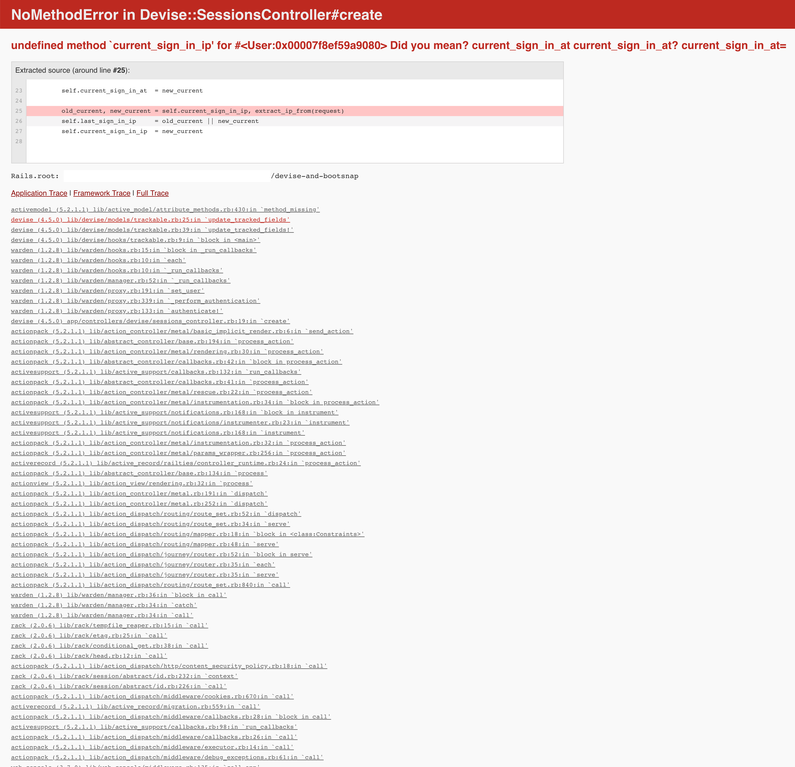

# README

This repository exposes a misbehaviour when using Rails 5.2, bootsnap and
Devise modules.

Install this rails app as usually (`bundle install`, `rails db:setup` etc.) and
try logging in with the example user (`user@example.com / password`). You'll see
an error message like the one below:



This shouldn't happen because of the file `lib/devise/models/trackable.rb`, which
customizes the `Devise::Models::Trackable` module by removing user IPs.

```
# frozen_string_literal: true

require 'devise/hooks/trackable'

module Devise
  module Models
    # Track information about your user sign in. It tracks the following columns:
    #
    # * sign_in_count      - Increased every time a sign in is made (by form, openid, oauth)
    # * current_sign_in_at - A timestamp updated when the user signs in
    # * last_sign_in_at    - Holds the timestamp of the previous sign in
    #
    module Trackable
      def self.required_fields(klass)
        [:current_sign_in_at, :last_sign_in_at, :sign_in_count]
      end

      def update_tracked_fields(request)
        old_current, new_current = self.current_sign_in_at, Time.now.utc
        self.last_sign_in_at     = old_current || new_current
        self.current_sign_in_at  = new_current

        self.sign_in_count ||= 0
        self.sign_in_count += 1
      end

      def update_tracked_fields!(request)
        # We have to check if the user is already persisted before running
        # `save` here because invalid users can be saved if we don't.
        # See https://github.com/plataformatec/devise/issues/4673 for more details.
        return if new_record?

        update_tracked_fields(request)
        save(validate: false)
      end
    end
  end
end
```

However, this file isn't loaded even if the `lib` dir is included in autoload
paths (see `config/application.rb#14`).

If you disable bootsnap by removing the `require 'bootsnap/setup'` line from
`config/boot.rb` and restart the app you can login without any error.


